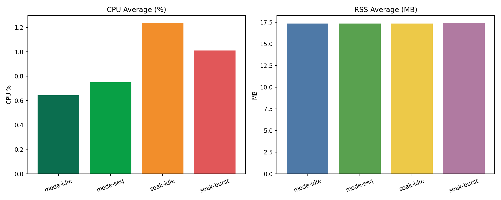
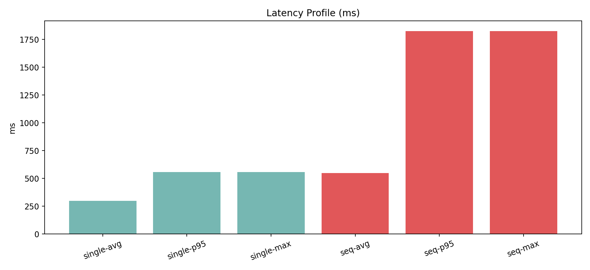
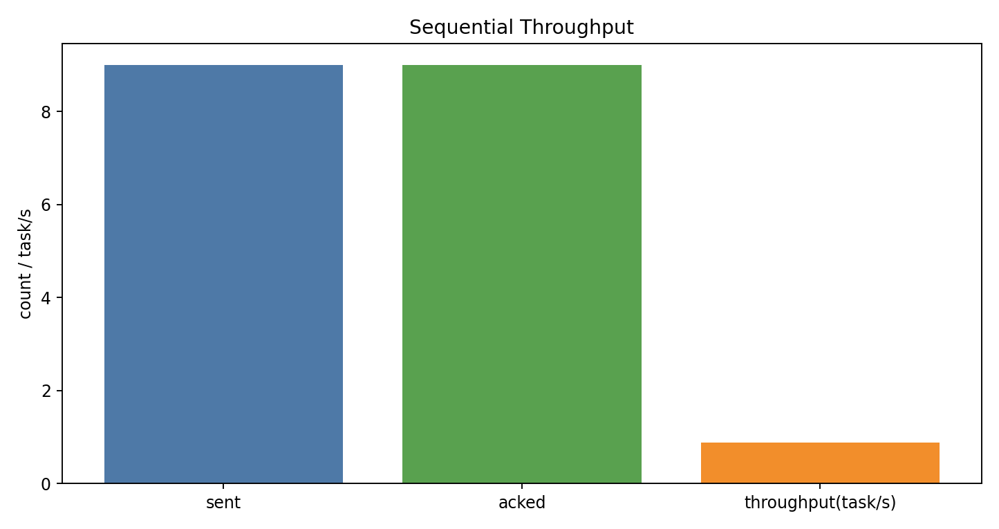
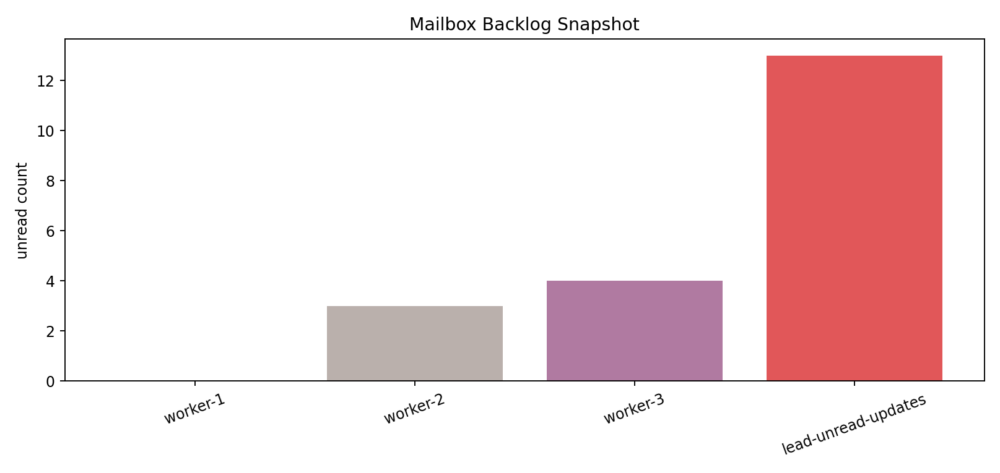

# codex-teams Benchmark Report

## Inputs
- mode benchmark JSON: `reports/benchmarks/2026-02-18/raw/mode_compare_inprocess.json`
- soak benchmark JSON: `reports/benchmarks/2026-02-18/raw/soak_inprocess.json`

## Key Metrics
- mode elapsed: 36.024s
- soak elapsed: 24.436s
- mode runtime process(es) last observed: 1
- single-task latency avg/p95/max: 297.93 / 558.47 / 558.47 ms
- sequential throughput: sent=9, acked=9, throughput=0.880 task/s
- mode CPU avg (idle/seq): 0.643% / 0.750%
- soak CPU avg (idle/burst): 1.235% / 1.011%
- soak RSS avg (idle/burst): 17.344 / 17.396 MB
- soak burst sent: 9
- soak lead unread worker updates: 13
- soak worker unread totals: {"worker-1": 0, "worker-2": 3, "worker-3": 4}

## Plots

